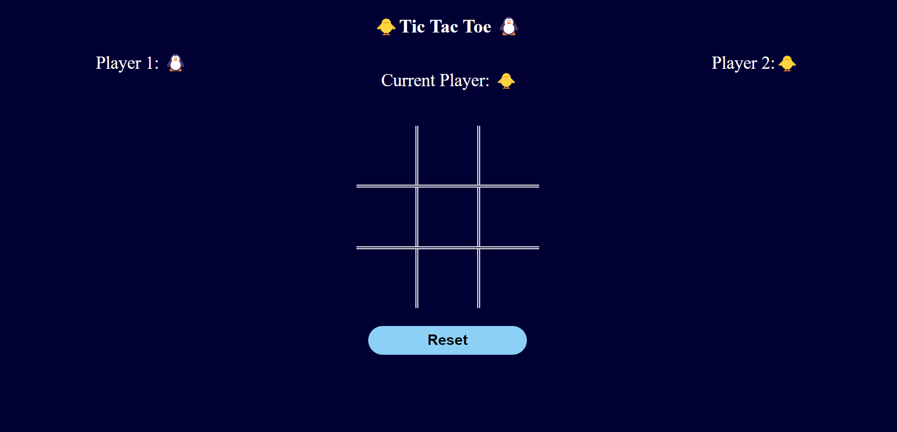

# Tic-Tac-Toe

This is a fun project where I made the classic Tic-Tac-Toe game using ReactJS. It's a game everyone knows, where you try to get three X's or O's in a row to win.

Sure! A Tic Tac Toe project typically involves creating a game where two players take turns marking spaces on a 3x3 grid. The goal is to get three of their symbols (traditionally X or O) in a row, either horizontally, vertically, or diagonally.

Source code:- https://github.com/achaltelmasre/Tic-Tac-Toe

live demo:- https://tic-tac-toe-achaltelmasre.vercel.app/